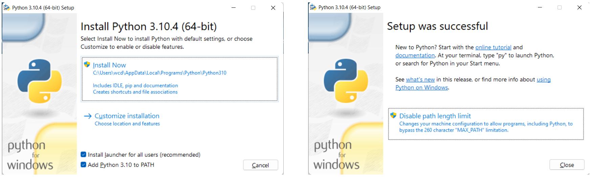

# Python Global Installation

## Download

[Download Python](https://www.python.org/)

## Install



## pip

In PowerShell as admin:

```
py -m pip install --upgrade pip setuptools wheel
```

## Build Tools for Visual Studio

There are some tasks better suited to C and you'll need to use a Python package with the needed C binings. Some packages that use these binings may need MSVC which allows `cl.exe` C/C++ compiler to run from the command line. 

For this, you will need to install [Build Tools for Visual Studio 202x](https://visualstudio.microsoft.com/downloads/#build-tools-for-visual-studio-2022). 

* Install **Workload: Desktop development with C++** - it specifically lists MSVC. 
* Use the default options - notice MSVC is listed under **Optional**.
